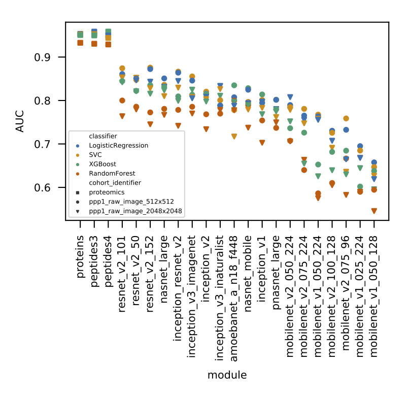

# mass_spec_trans_coding
## Vector representation of rasterized MS data via transferred encoders

Deep neural networks trained on large datasets and many classes (ImageNet) such as models available from tensorflow hub have been shown to be well suited for transfer learning. Even without finetuning, vector representations of other classes of natural images are informative and useful for e.g. a different classification task. In other words, some models are able to generalize to other natural images. Or maybe even images from a completely different domain?

### Could vector representations of MS raw data be useful?  
We explore this question by
1. Rasterizing the raw MS data to obtain **images**.  
    This is done with small modifications to the ProteoWizard software, and not in the scope of this repo.
2. Using a tensorflow hub model to encode images (resized to fit) as feature **vectors**. No finetuning.  
3. Optionally we can only use the MS1 vector, or concatenate with all MS2 vectors (see [MS intro](###mass-spectrometry-intro) for brief explanation of MS1/MS2)
4. Learning a binary **classification** with the samples' tumor/normal phenotype as label. We do shallow hyperparameter grid search with crossvalidation in training and evaluate with AUC on a testset.  

But for each of these steps we have some choices:
1. 2 resolutions of the resulting images
2. 19 encoder modules  
    plus 3 "encodings" by classical proteomics analysis, i.e. protein or peptide quantities  
3. 2 versions of vectors ('ms1_only' vs 'all_modalities')
4. 4 machine learning algorithms



The figure shows that the classification performance from feature vectors from transferred encoding with tensorflow hub models does not match the protein expression. The protein expression vector is also less affected by the choice of classifier.
Interestingly, some models still encode the images so to allow e.g, Logistic Regression to achieve surprisingly high AUC.  
Resnet generalizes best to "MS images", while MobileNets are not useful.


### Mass spectrometry intro
A mass spectrometer then ionizes/charges the molecules and measures intensities (more ions, more signal) at mass to charge ratio (m/z). In tandem mass spectrometry (MS/MS) this would be MS1, compared to MS2 where molecules in a given m/z range are selected and further split into fragment ions and m/z measured only measured now.

In proteomic mass spectrometry, proteins are first split in peptides and the components somewhat separated over time with chromatography.  
The MS raw data spans intensity peaks on the m/z axis at given points along the time axis.  

The data is usually analysed with specialized tools to calculate quantities of peptides. These tools work junction with "spectral libraries" which contains experience of which measured fragment ions map to which peptides and therefore allows quantification of the respective protein via the measured amount of the ions.

### The mstc package
[](https://travis-ci.com/PhosphorylatedRabbits/mass_spec_trans_coding)  
There is [Documention](https://phosphorylatedrabbits.github.io/mass_spec_trans_coding/) of the package code.

The processing subpackage defines operations to define a processing pipeline from reading, encoding, transforming, etc.
It's not specific to MS.
Since not all images fit into memory for encoding, we make use of xarray due to its lazy operations in junction with dasks lazy imread.
It's also convenient to handle indexes and attributes.

The learning subpackage only defines a cross validation learning pipeline.

#### Installation

The quickest way to install the package would be
```
pip install git+https://github.com/PhosphorylatedRabbits/mass_spec_trans_coding@master
```
or from the `git clone`d directory
```
pip install .
```

But to run the experiments, there are additional dependencies. See [Environment](#environment)

### Experiments
The scripts for encoding, learning and evaluation as well as result exploration and plotting the manuscripts figures can be found in the experiments directory.  
These scripts are specifically tailored to the dataset. Some paths are hardcoded to data/ or experiments/, so edit them or make sure to run from the repo root and download the [Data](#data) accordingly.

```console
python experiments/run_encoding.py --help
usage: run_encoding.py [-h] input_directory output_directory [batch_size]

positional arguments:
  input_directory
  output_directory
  batch_size        [4]

optional arguments:
  -h, --help        show this help message and exit
```

```console
python experiments/run_learning_ppp1.py --help
usage: run_learning_ppp1.py [-h] [-all]
                            [-cohort-identifier {ppp1_raw_image_2048x2048,ppp1_raw_image_512x512,ppp1_cropped_image_2048x973,ppp1_cropped_image_512x243}]
                            [-module all] [-classifier all] [-n-jobs 1]
                            annotation_csv index_csv expression_directory
                            encoded_directory output_directory

positional arguments:
  annotation_csv
  index_csv
  expression_directory
  encoded_directory
  output_directory

optional arguments:
  -h, --help            show this help message and exit
  -all, --all-modalities
                        use not only ms1 but also all ms2
  -cohort-identifier {ppp1_raw_image_2048x2048,ppp1_raw_image_512x512,ppp1_cropped_image_2048x973,ppp1_cropped_image_512x243}
                        cohort_directory of original image data
  -module all           name of single TF Hub module used for encoding or
                        "expressions" (default: all)
  -classifier all       name of single classifier to use for classification
                        (default: all)
  -n-jobs 1             number of parallel jobs in GridSearch (default: 1)
```

The results can be aggregated with `experiments/collect_results.py` and explored with `experiments/results_ppp1.py`

The `experiments/manuscript/` directory contains everything to recreate the figures in the manuscript.

#### Environment
The experiments directory is not included in the mstc package, so you will need a clone.
```
git clone https://github.com/PhosphorylatedRabbits/mass_spec_trans_coding.git
cd mass_spec_trans_coding
```
The full environment to run the scripts is defined in `requirements.txt`.  
However, e.g. `xgboost` from pypi fails on some systems, so the recommended way is a conda environment.  
```
conda env create -f conda.yml
conda activate mstc
pip install .
```

### Data
The data used for the experiments consists of 458 tumor and 455 normal prostate samples. Please refer to the [manuscript](#references) for more information.

Most data used in the repo can be downloaded from [Box](https://ibm.box.com/v/mstc-supplementary).  
Available are
- rasterized MS images
- encoded vectors
- tumor/normal label
- classification results

Whereas
- original MS mXML data
- protein/peptide expression values  
cannot be made available publicly.

### References
This work is published in [Bioinformatics](https://doi.org/10.1093/bioinformatics/btab311) through ISMB/ECCB 21 proceedings. For a typeable url, use [ibm.biz/mstc-paper](https://ibm.biz/mstc-paper).
```bibtex
@article{10.1093/bioinformatics/btab311,
    author = {Cadow, Joris and Manica, Matteo and Mathis, Roland and Guo, Tiannan and Aebersold, Ruedi and Rodríguez Martínez, María},
    title = "{On the feasibility of deep learning applications using raw mass spectrometry data}",
    journal = {Bioinformatics},
    volume = {37},
    number = {Supplement_1},
    pages = {i245-i253},
    year = {2021},
    month = {07},
    abstract = "{In recent years, SWATH-MS has become the proteomic method of choice for data-independent–acquisition, as it enables high proteome coverage, accuracy and reproducibility. However, data analysis is convoluted and requires prior information and expert curation. Furthermore, as quantification is limited to a small set of peptides, potentially important biological information may be discarded. Here we demonstrate that deep learning can be used to learn discriminative features directly from raw MS data, eliminating hence the need of elaborate data processing pipelines. Using transfer learning to overcome sample sparsity, we exploit a collection of publicly available deep learning models already trained for the task of natural image classification. These models are used to produce feature vectors from each mass spectrometry (MS) raw image, which are later used as input for a classifier trained to distinguish tumor from normal prostate biopsies. Although the deep learning models were originally trained for a completely different classification task and no additional fine-tuning is performed on them, we achieve a highly remarkable classification performance of 0.876 AUC. We investigate different types of image preprocessing and encoding. We also investigate whether the inclusion of the secondary MS2 spectra improves the classification performance. Throughout all tested models, we use standard protein expression vectors as gold standards. Even with our naïve implementation, our results suggest that the application of deep learning and transfer learning techniques might pave the way to the broader usage of raw mass spectrometry data in real-time diagnosis.The open source code used to generate the results from MS images is available on GitHub: https://ibm.biz/mstransc. The raw MS data underlying this article cannot be shared publicly for the privacy of individuals that participated in the study. Processed data including the MS images, their encodings, classification labels and results can be accessed at the following link: https://ibm.box.com/v/mstc-supplementary.Supplementary data are available at Bioinformatics online.}",
    issn = {1367-4803},
    doi = {10.1093/bioinformatics/btab311},
    url = {https://doi.org/10.1093/bioinformatics/btab311},
    eprint = {https://academic.oup.com/bioinformatics/article-pdf/37/Supplement\_1/i245/38921531/btab311\_supplementary\_data.pdf},
}
```
